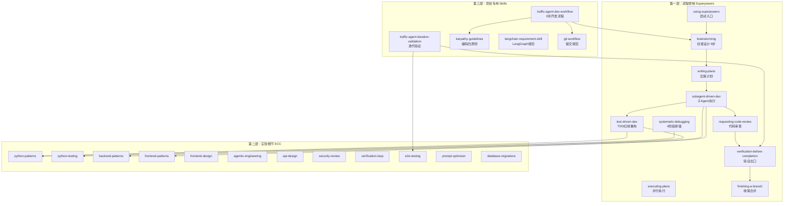
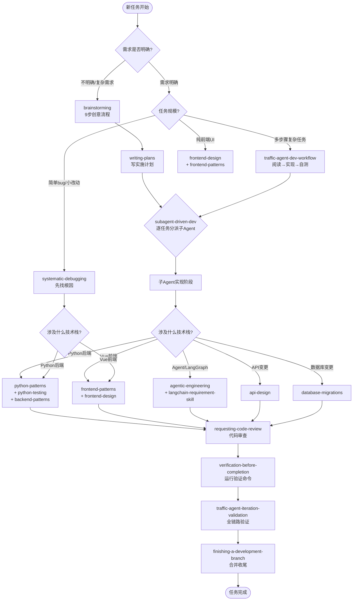
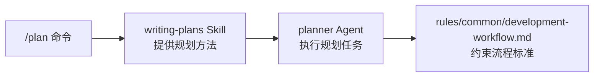

# Traffic Agent — Skill 调用逻辑汇总与开发标准

> **本文档定位**：AI 工具和后续维护人员的**第一入口文档**。新任务开始时，必须优先读取本文档，理解 Skill 调用逻辑后再开始开发。
>
> **与 AGENTS.md 的关系**：AGENTS.md 定义了"项目是什么"（技术栈、架构、约定），本文档定义了"怎么用 Skill 做"（调用流程、场景化路径、优先级规则）。两者互补，本文档为执行层标准。

---

## 一、Skill 体系全景图

本项目配置了 **三套 Skill 体系**，按职责分层，各司其职：



### 1.1 Superpowers — 流程控制（宏观纪律）

**职责**：控制"怎么做"的流程，确保开发过程规范可控。

| # | Skill | 触发时机 | 核心内容 |
|---|-------|---------|---------|
| 1 | `using-superpowers` | **每次会话启动** | 技能发现、优先级规则、Red Flags |
| 2 | `brainstorming` | 进入 Plan Mode、需求不明确时 | 9步创意流程：探索上下文→提问→提出2-3方案→设计→写spec→自审→用户审→转writing-plans |
| 3 | `writing-plans` | 有 spec 后、多步骤任务前 | 写详细实施计划，每步2-5分钟粒度，精确到文件路径和代码 |
| 4 | `subagent-driven-development` | 有计划且任务独立时 | 逐任务分派子Agent，两阶段审查（spec合规→代码质量） |
| 5 | `executing-plans` | 任务可完全并行时 | 开独立 Session 批量执行 |
| 6 | `test-driven-development` | 新功能/修bug，在写实现之前 | RED→GREEN→REFACTOR，必须先写失败测试 |
| 7 | `systematic-debugging` | 任何bug/测试失败/异常 | 4阶段：根因调查→模式分析→假设验证→实施修复，**禁止无根因修复** |
| 8 | `dispatching-parallel-agents` | 2+独立问题域可同时处理 | 并行分派多个子Agent |
| 9 | `requesting-code-review` | 每任务完成、合并前 | 分派code-reviewer子Agent审查 |
| 10 | `receiving-code-review` | 收到审查反馈 | 按优先级处理反馈 |
| 11 | `verification-before-completion` | **任何完成声明前** | 必须先运行验证命令并确认输出，否则禁止声称完成 |
| 12 | `finishing-a-development-branch` | 所有任务完成后 | 测试验证→4选项（合并/PR/保留/丢弃）→清理worktree |
| 13 | `using-git-worktrees` | 需要隔离工作区 | Git worktree 创建与管理 |
| 14 | `writing-skills` | 创建/编辑项目Skill | Skill编写规范 |

### 1.2 ECC — 实现细节（微观质量）

**职责**：控制"写成什么样"的质量，提供领域最佳实践。

| # | Skill | 触发时机 | 覆盖领域 |
|---|-------|---------|---------|
| 1 | `python-patterns` | 编写/评审Python代码 | PEP 8、类型注解、dataclass、async/await、上下文管理器、装饰器 |
| 2 | `python-testing` | 编写pytest测试 | fixture、parametrize、mock、覆盖率 |
| 3 | `backend-patterns` | 设计API、数据库、中间件 | RESTful设计、Repository/Service模式、N+1优化、缓存、错误处理 |
| 4 | `frontend-patterns` | Vue/React/TS前端开发 | 组合模式、Hooks、状态管理、性能优化、虚拟化 |
| 5 | `frontend-design` | UI美化、交互设计 | 视觉设计、动效、响应式布局 |
| 6 | `agentic-engineering` | Agent架构设计 | Eval-first、15分钟任务分解、模型路由、成本追踪 |
| 7 | `api-design` | 新增/修改REST API | 端点设计、请求/响应格式、版本控制 |
| 8 | `security-review` | 认证/授权/输入验证 | OWASP常见漏洞、敏感数据保护 |
| 9 | `verification-loop` | 修改后自检 | Build→Type Check→Lint→Test→Security→Diff六阶段 |
| 10 | `e2e-testing` | 全链路浏览器验证 | Chrome DevTools MCP自动化 |
| 11 | `prompt-optimizer` | 优化LLM Prompt | Prompt结构、few-shot、token优化 |
| 12 | `database-migrations` | 修改数据库Schema | 迁移策略、回滚方案 |
| 13 | `docker-patterns` | Docker化（远期） | Dockerfile、compose、多阶段构建 |
| 14 | `postgres-patterns` | PostgreSQL迁移（远期） | 索引、查询优化、连接池 |
| 15 | `code-tour` | 新成员了解代码库 | 代码库导览 |

### 1.3 项目专用 Skills

| # | Skill | 触发时机 | 核心内容 |
|---|-------|---------|---------|
| 1 | `traffic-agent-dev-workflow` | **所有功能开发和bug修复** | 8步标准流程：阅读→实现→自测→全链路→清理→文档→汇报→提交 |
| 2 | `traffic-agent-iteration-validation` | 每轮迭代完成后 | 自动化测试→启动服务→Chrome全链路→持久化验证→文档更新→清理 |
| 3 | `karpathy-guidelines` | 编码实现阶段 | 四原则：思考先行、简洁优先、外科手术式变更、目标驱动 |
| 4 | `langchain-requirement-skill` | LangChain/LangGraph开发 | LangGraph StateGraph、Send()、Subgraph规范 |
| 5 | `git-workflow` | 提交代码时 | Commit message格式、分支策略 |

---

## 二、Skill 调用逻辑 —— 场景化路径

### 2.1 核心调用链（主流程）



### 2.2 场景一：新功能开发（标准路径）

```
1. brainstorming          → 理解需求，提出方案，产出设计文档
2. writing-plans          → 将设计转化为bite-size实施计划
3. subagent-driven-dev    → 逐任务执行（内部自动触发以下Skills）：
   ├─ test-driven-development   （RED→GREEN→REFACTOR）
   ├─ karpathy-guidelines       （4条编码原则）
   ├─ python-patterns           （Python代码）
   ├─ backend-patterns          （后端架构）
   ├─ frontend-patterns         （前端代码）
   └─ requesting-code-review    （spec合规 + 代码质量 两阶段审查）
4. traffic-agent-iteration-validation  → 全链路Chrome验证
5. verification-before-completion      → 验证命令确认
6. finishing-a-development-branch      → 合并/PR/保留
7. git-workflow                        → 规范化提交
```

**关键规则**：
- brainstorming 的**硬门槛**：在用户批准设计方案前，**禁止**调用任何实现类Skill
- writing-plans 产出的计划必须精确到文件路径和代码级别
- subagent-driven-dev 中每个子任务必须经过 spec合规→代码质量 两阶段审查

### 2.3 场景二：Bug 修复

```
1. systematic-debugging   → 4阶段找根因（禁止无根因修复！）
   ├─ Phase 1: 读错误→复现→查变更→收集证据→追踪数据流
   ├─ Phase 2: 找成功案例→对比差异→理解依赖
   ├─ Phase 3: 形成假说→最小化测试→验证
   └─ Phase 4: 写失败测试→实施修复→验证通过
2. test-driven-development  → RED: 写复现bug的测试
3. python-patterns / frontend-patterns  → 按规范修复
4. verification-before-completion       → 运行测试验证
5. git-workflow                         → 规范化提交
```

**关键规则**：
- **Iron Law**：NO FIXES WITHOUT ROOT CAUSE INVESTIGATION FIRST
- 尝试3次修复都失败 → **必须**停止，质疑架构设计，与用户讨论
- bug修复必须配套回归测试（先Red后Green）

### 2.4 场景三：纯前端修改（UI/样式）

```
1. frontend-design        → 视觉设计和交互模式
2. frontend-patterns      → Vue/TS实现模式
3. traffic-agent-iteration-validation  → Chrome全链路验证
4. verification-before-completion      → 确认无控制台错误
5. git-workflow                         → 规范化提交
```

**关键规则**：
- 纯样式修改可跳过 brainstorming/writing-plans（但如果涉及交互逻辑变更需要走标准路径）
- 必须过 Chrome MCP 全链路验证

### 2.5 场景四：简单小改动（typo/配置/单文件）

```
1. karpathy-guidelines    → 外科手术式变更（只改必须改的）
2. python-patterns / 对应ECC   → 代码规范
3. verification-before-completion  → 运行相关测试
4. git-workflow                    → 规范化提交
```

---

## 三、调用优先级规则

### 3.1 通用规则

| 优先级 | 规则 | 来源 |
|--------|------|------|
| **最高** | 用户显式指令 > Skill 指令 > 系统默认行为 | using-superpowers |
| **入口** | 任何响应前，只要1%可能适用就调Skill | using-superpowers |
| **流程优先** | 流程类Skill（brainstorming/debugging）先于实现类Skill | using-superpowers |
| **硬性** | TDD、debugging、verification-* 必须严格遵循，不可变通 | 各Skill本体 |
| **柔性** | patterns类可适应上下文调整 | 各Skill本体 |

### 3.2 禁止行为（Red Flags 汇总）

| 行为 | 违反的Skill |
|------|-------------|
| "这很简单，不需要流程" | using-superpowers |
| "我先探索下代码库" | using-superpowers（应先检查Skill） |
| 不写测试直接写实现代码 | test-driven-development |
| "先快速修一下，后面再查根因" | systematic-debugging |
| "应该通过了"、"似乎没问题"（未运行验证） | verification-before-completion |
| "只是个小改动，跳过审查" | requesting-code-review |
| 顺手重构无关代码 | karpathy-guidelines |
| "以备将来"的过度抽象 | karpathy-guidelines |
| 未确认就声称完成 | verification-before-completion |
| 尝试第4次修复 | systematic-debugging（应质疑架构） |

### 3.3 项目特有约束

触发 `traffic-agent-dev-workflow` 后，额外遵守：
- **回复语言**：始终用中文回复用户
- **生成数量**：每次生成流量个数 ≤ 5（Ollama性能限制）
- **后端启动**：必须在 `.venv` 虚拟环境中启动
- **不主动推送**：提交后等用户指示再推送
- **进程清理**：必须用 `Stop-Process` 终止前后端进程，不用 `taskkill`

---

## 四、Skill 关联映射 —— "改什么调什么"

### 4.1 按改动文件类型

| 改动涉及 | 必须调用的 Skill |
|----------|-----------------|
| `backend/app/graph/nodes.py` | `python-patterns` + `agentic-engineering` + `langchain-requirement-skill` |
| `backend/app/graph/workflow.py` | `python-patterns` + `agentic-engineering` + `langchain-requirement-skill` |
| `backend/app/services/generator.py` | `python-patterns` + `python-testing` |
| `backend/app/services/quality_validator.py` | `python-patterns` + `python-testing` |
| `backend/app/api/routes.py` | `api-design` + `backend-patterns` |
| `backend/app/models/schemas.py` | `python-patterns` + `api-design` |
| `backend/app/db/database.py` | `backend-patterns` + `database-migrations` |
| `backend/app/services/langchain_service.py` | `prompt-optimizer` + `langchain-requirement-skill` |
| `frontend/src/**` (Vue组件) | `frontend-patterns` + `frontend-design` |
| `frontend/src/**` (状态管理) | `frontend-patterns` |
| `.qcoder/skills/**/SKILL.md` | `writing-skills` |

> **注**：以上为基础映射。实际开发流程中 `test-driven-development`、`karpathy-guidelines`、`verification-before-completion` 为全局必调。

### 4.2 按测试文件映射

| 改动的测试文件 | 对应源码 | 验证命令 |
|---------------|---------|---------|
| `tests/test_nodes.py` | `graph/nodes.py` | `python -m pytest tests/test_nodes.py -v` |
| `tests/test_graph_runner.py` | `graph/workflow.py` + `services/graph_runner.py` | `python -m pytest tests/test_graph_runner.py -v` |
| `tests/test_quality_evaluator.py` | `services/quality_validator.py` + `services/generator.py` | `python -m pytest tests/test_quality_evaluator.py -v` |
| `tests/test_generator_industries.py` | `services/generator.py` | `python -m pytest tests/test_generator_industries.py -v` |
| `tests/test_routes.py` | `api/routes.py`（全栈集成） | `python -m pytest tests/test_routes.py -v` |

---

## 五、快速参考卡片

### 5.1 新任务启动 Checklist

```
□ 1. 读取本文档（SKILL_INVOCATION_GUIDE.md）
□ 2. 确认任务类型（新功能 / Bug修复 / 前端UI / 小改动）
□ 3. 按场景选择调用路径
□ 4. 触发 using-superpowers 确认Skill发现
□ 5. 按路径依次调用Skill
□ 6. 最终出口：verification-before-completion + traffic-agent-iteration-validation
```

### 5.2 场景速查表

| 场景 | 入口Skill | 核心链路 | 出口条件 |
|------|----------|---------|---------|
| 新功能 | `brainstorming` | → plans → subagent-dev → review → verify | pytest全绿 + Chrome验证通过 |
| Bug修复 | `systematic-debugging` | → TDD → patterns → verify | 回归测试通过 + 根因确认 |
| 纯前端 | `frontend-design` | → frontend-patterns → e2e | Chrome无错误 + 操作流程完整 |
| 小改动 | `karpathy-guidelines` | → patterns → verify | 相关测试通过 |
| LangGraph变更 | `langchain-requirement-skill` | → agentic-engineering → patterns | SSE流正常 + 状态机正确 |

### 5.3 关键命令速查

```powershell
# 测试
cd backend; python -m pytest tests/ -v --tb=short

# 后端启动
cd backend; .\.venv\Scripts\Activate.ps1; python -m uvicorn app.main:app --host 0.0.0.0 --port 8000 --reload

# 前端启动
cd frontend; npm run dev

# 进程清理（必须用Stop-Process！）
Stop-Process -Name python -Force -ErrorAction SilentlyContinue
Stop-Process -Name node -Force -ErrorAction SilentlyContinue
```

---

## 六、与 AGENTS.md 的分工

| 维度 | AGENTS.md | 本文档 (SKILL_INVOCATION_GUIDE.md) |
|------|-----------|-------------------------------------|
| **定位** | 项目说明书 | 执行标准书 |
| **内容** | 技术栈、架构、目录结构、约定 | Skill体系、调用逻辑、场景路径、优先级 |
| **读者** | 新人了解项目 | AI工具和开发者执行任务 |
| **更新频率** | 项目里程碑变更时 | Skill体系有新成员或流程变更时 |
| **阅读顺序** | 先读 | 紧接着读（第一入口） |

---

## 七、维护说明

### 7.1 何时更新本文档

- 新增/移除 Skill 时
- Skill 调用逻辑发生变化时
- 项目技术栈变更影响 Skill 映射时
- 发现新的最佳实践场景时

### 7.2 更新规则

1. 更新后在 AGENTS.md 的 "当前状态" 中记录
2. 涉及调用链变化的，必须同步更新流程图
3. 新增 Skill 必须在 1.1/1.2/1.3 对应表格中登记

---

## 八、Qcoder Agents — 子代理执行层

> **配置目录**：`.qcoder/agents/`（12 个 md 文件）— qcoder 启动时自动加载

### 8.1 Agent 与 Skill 的分工

```
Skill（流程控制层）        Agent（执行层）
─────────────────────      ─────────────────
定义"怎么做"的流程         定义"谁来做"的角色
brainstorming              → planner / architect
writing-plans              → planner
subagent-driven-dev        → tdd-guide / python-reviewer / code-reviewer
systematic-debugging       → build-error-resolver / code-explorer
test-driven-development    → tdd-guide
requesting-code-review     → python-reviewer / code-reviewer / security-reviewer
traffic-agent-iteration    → e2e-runner
finishing-a-branch         → doc-updater / refactor-cleaner
```

### 8.2 Agent 速查表

| Agent | model | 适用场景 | 调用的 Skill |
|-------|-------|---------|-------------|
| `python-reviewer` | sonnet | Python 代码变更 | `python-patterns` |
| `code-reviewer` | sonnet | 全栈代码审查 | `requesting-code-review` |
| `tdd-guide` | sonnet | TDD 红绿重构 | `test-driven-development` |
| `planner` | opus | 复杂功能规划 | `writing-plans` |
| `architect` | opus | 架构决策 | `brainstorming` |
| `security-reviewer` | sonnet | 安全审查 | `security-review` |
| `e2e-runner` | sonnet | Chrome 全链路 | `traffic-agent-iteration-validation` |
| `build-error-resolver` | sonnet | 构建失败 | `systematic-debugging` |
| `doc-updater` | sonnet | 文档同步 | `traffic-agent-dev-workflow`（步骤6） |
| `refactor-cleaner` | sonnet | 死代码清理 | `karpathy-guidelines` |
| `code-explorer` | sonnet | 代码库探索 | `traffic-agent-dev-workflow`（步骤1） |
| `code-simplifier` | sonnet | 降复杂度 | `karpathy-guidelines` |

### 8.3 Agent 触发规则

1. **自动触发**：`subagent-driven-development` 执行时，根据任务类型自动分派对应 Agent
2. **手动触发**：可在开发过程中直接调用 Agent 执行专项任务
3. **并行执行**：独立的 Agent 任务（如 security-reviewer + python-reviewer）可同时运行
4. **就近优先**：项目级 `.qcoder/agents/` 中的 Agent 优先于全局 `~/.claude/agents/`

---

## 九、Rules 与 Commands — 新增配置层

> **配置时间**：2026-05-04，从 ECC 仓库精选引入

在原有 Skill + Agent 两层体系之上，新增了 Rules 和 Commands 两个配置层，形成更完整的开发规范体系：

```
Rules（标准约束层）  →  定义"要达到什么标准"
Commands（工作流层）  →  定义"按什么步骤做"
Skills（参考知识层）  →  定义"怎么做才对"
Agents（执行单元层）  →  定义"谁来做"
```

### 9.1 Rules — 项目级编码规范

> **目录**：`.qcoder/rules/`（22 个文件，3 套规则）

**分层设计**：common 定义通用标准 → python/web 语言层覆盖特定技术栈

| 层级 | 目录 | 文件数 | 覆盖范围 |
|------|------|--------|---------|
| 通用标准 | `common/` | 10 | 编码风格、测试、安全、Git、开发流程、代码审查、Agent 编排、性能、Hook 架构 |
| Python 专用 | `python/` | 5 | PEP 8、pytest、bandit 安全、Protocol/dataclass、ruff/mypy hooks |
| Web 前端专用 | `web/` | 7 | 文件组织、CSS 变量、视觉回归、可访问性、跨浏览器测试、前端安全 |

**Rules vs Skills 关键区别**：
- `rules/python/testing.md` → 要求 80% 覆盖率、TDD RED→GREEN→REFACTOR → **这是标准**
- `skills/python-testing/` → 教怎么用 pytest fixture、parametrize、mock → **这是方法**

**优先级**：
1. 语言专用规则覆盖通用规则（如 python/coding-style.md > common/coding-style.md）
2. Rules 定义硬性标准（必须遵守），Skills 提供参考（灵活应用）

### 9.2 Commands — 自定义斜杠命令

> **目录**：`.cursor/commands/`（8 个 .md 命令）

每个命令是一个结构化的多阶段工作流，用户通过 `/command` 主动调用：

| 命令 | 阶段/步骤 | 触发场景 |
|------|----------|---------|
| `/python-review` | 识别变更 → 静态分析 → 安全检查 → 类型审查 → 生成报告 | Python 代码变更后 |
| `/code-review` | 本地模式：Gather→Review→Report / PR模式：Fetch→Context→Review→Validate→Decide→Report→Publish | 提交前 / PR 审查 |
| `/feature-dev` | Discovery→Exploration→Questions→Design→Implementation→Review→Summary | 新功能启动 |
| `/plan` | 需求重述→风险识别→分步计划→等待确认 | 复杂任务规划 |
| `/test-coverage` | 检测框架→分析报告→生成补测→验证→报告 | 提交前质量检查 |
| `/refactor-clean` | 死代码检测→分级（SAFE/CAUTION/DANGER）→安全删除→合并重复→报告 | 代码维护 |
| `/quality-gate` | 检测语言→格式化检查→lint→类型检查→修复列表 | 合并前最终检查 |
| `/evolve` | 读取本能→分组聚类→识别候选→分析报告（可选生成文件） | 重复模式自动化 |

**Commands vs Skill vs Agent 的关系**：



- **Commands** 是用户入口（主动 `/command`）
- **Skills** 提供方法指导（被 Command/Agent 引用）
- **Agents** 执行具体任务（被 Command/Skill 分派）
- **Rules** 约束输出质量（被所有层引用）

---

## 十、外部配置源（ECC 引用）

> **原则**：本项目 `.qcoder/` 和 `.cursor/` 中的配置从 [everything-claude-code](https://github.com/affaan-m/everything-claude-code) 仓库精选而来。后续开发中遇到需要新增的配置类型，**优先去该仓库查找**，找到合适的配置后复制回本项目，而非从零编写。

### 10.1 已集成配置一览

| 配置类型 | 目标目录 | 数量 | 状态 |
|---------|---------|------|------|
| Skills | `.qcoder/skills/` | 192 目录 | ✅ 已完成 |
| Agents | `.qcoder/agents/` | 12 文件 | ✅ 已完成 |
| Rules | `.qcoder/rules/` | 22 文件（3 套） | ✅ 已完成 |
| Commands | `.cursor/commands/` | 8 文件 | ✅ 已完成 |

### 10.2 ECC 仓库结构速查

```
https://github.com/affaan-m/everything-claude-code
├── skills/         (182 目录) — 技能定义 → .qcoder/skills/
├── agents/         (48 文件)  — 子代理定义 → .qcoder/agents/
├── rules/          (15 套)    — 编码规范 → .qcoder/rules/
│   ├── common/     (10 文件)  — 通用规则
│   ├── python/     (5 文件)   — Python 规则
│   ├── typescript/  (5 文件)  — TypeScript 规则
│   ├── web/        (7 文件)   — 前端规则
│   └── ... (golang/kotlin/rust/swift/php/java/cpp/csharp/dart/perl)
├── commands/       (68 文件)  — 自定义命令 → .cursor/commands/
├── hooks/          (hooks.json + README) — 事件驱动自动化 → .cursor/hooks/
├── mcp-configs/    (mcp-servers.json)    — MCP 服务器配置 → .cursor/mcp-configs/
├── contexts/       (dev/review/research.md) — 工作模式上下文 → .cursor/contexts/
├── .cursor/        (hooks/rules/skills) — Cursor IDE 专属配置
├── .github/        (workflows/) — CI/CD 流水线
└── scripts/        (33 文件)   — 安装/同步/诊断脚本
```

### 10.3 按需引入路径

| 需要的配置 | ECC 源路径 | 目标路径 |
|-----------|-----------|---------|
| 事件驱动 Hooks | `hooks/hooks.json` + `scripts/hooks/` | `.cursor/hooks/` + `.cursor/hooks.json` |
| MCP 服务器 | `mcp-configs/mcp-servers.json` | `.cursor/mcp-configs/` |
| 工作模式 Context | `contexts/dev.md` 等 | `.cursor/contexts/` |
| 更多 Commands | `commands/` 中其他 .md | `.cursor/commands/` |
| 更多语言 Rules | `rules/typescript/` 等 | `.qcoder/rules/` |
| GitHub CI/CD | `.github/workflows/` | `.github/workflows/` |

### 10.4 标准引入流程

```
1. 确认需求 → 需要 Hooks/MCP/新语言Rules/其他？
2. 查阅 ECC → 在 [everything-claude-code](https://github.com/affaan-m/everything-claude-code) 仓库中找到对应目录
3. 筛选适配 → 根据本项目技术栈（FastAPI+Vue+LangGraph）精选相关文件
4. 复制到项目 → 放入对应 .qcoder/ 或 .cursor/ 子目录
5. 更新文档 →
   ├─ AGENTS.md: 在 3.0x 节新增说明 + 9.1 更新状态表
   └─ 本文档: 在第九章/第十章补充对应内容
```

---

> **最后强调**：本文档的定位是**AI工具和后续维护人员的第一入口**。在任何开发任务开始前，AI 必须优先读取本文档，理解当前 Skill 体系结构和调用逻辑，再按照场景化路径执行。不遵循本文档的调用逻辑 = 流程失控 = 降低代码质量。
